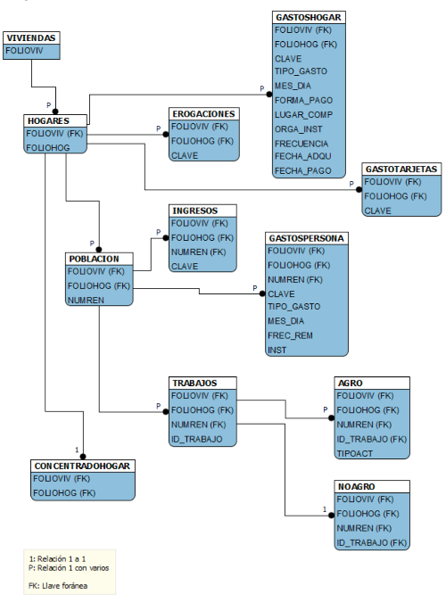

# Análisis ENIGH 30 años

## 2014

Antes de descargar datos y escribir código, es necesario conocer los datos que vamos a tratar. Toda encuesta del INEGI deberá tener un archivo que describa la base de datos. Esto es diferente de la metodología o de la presentación de resultados. La descripción de la base de datos o **descriptor de archivos** resume la estructura de todos los datasets (tablas) que en conjunto forman la base de datos.

La descripción de la base de datos de la ENIGHH 2014 (tradicional) está en [este enlace](http://internet.contenidos.inegi.org.mx/contenidos/Productos/prod_serv/contenidos/espanol/bvinegi/productos/nueva_estruc/702825070366.pdf)

Como lo muestra el índice, se tienen dos secciones principales:
1. Características de la base de datos de la ENIGH 2014
2. Contenido de la base de datos de la ENIGH 2014

**Nota: No hay que abrumarse por la canitdad de páginas de este tipo de archivos (192 en este caso) porque por lo general el 90% de las páginas contienen el catálogo de códigos de respuesta, o sea los valores que tendrán las variables.**
Ejemplo: 

###### Catálogo de parentesco

| Código | Descripción                                       |
|--------|---------------------------------------------------|
| 101    | Jefe(a)                                           |
| 202    | Concubino(a)                                      |
| 301    | Hijo(a), hijo(a) consanguíneo, hijo(a) reconocido |
| 302    | Hijo(a) adoptivo(a)                               |
| ...    | ...                                               |
| 999    | Parentesco no especificado                        |

Este diagrama (llamados [diagramas de entidad-relación](https://en.wikipedia.org/wiki/Entity%E2%80%93relationship_model)) muestra todas las tablas que forman la base de datos (cada tabla es un archivo que se descarga del portal del INEGI) y cómo se relaciona una tabla con otra, es decir, a través de qué variable podemos **hacer <em>merges</em> entre tablas**.

La base de datos de la ENIGH 2014, está conformada por 11 tablas de datos normalizadas (todos los atributos no llave
de una relación dependen sólo y exclusivamente de la llave) en las que se distribuye la información obtenida de la
encuesta de acuerdo con los temas más usados para realizar análisis y tabulados; adicional a la base de datos se
publica una tabla resumen con información a nivel hogar llamada **CONCENTRADOHOGAR**.

Como indica el párrafo anterior, la ENIGH 2014 cuenta con una tabla resumen llamada **CONCENTRADOHOGAR**. Empezar analizando esta tabla es un buen primer paso.

